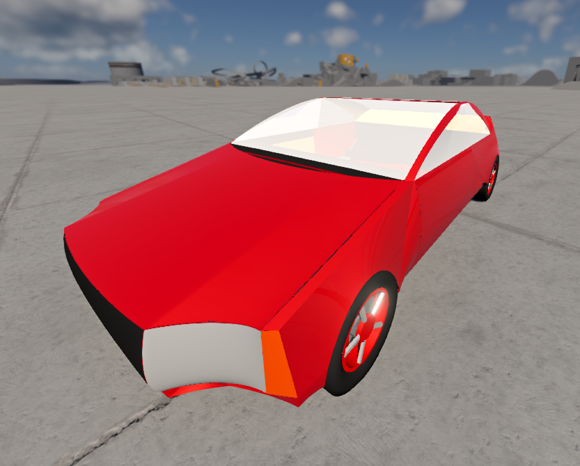

# MiNini

MiNini electric vehicle for BeamNG.drive, preserved at **v22_65**. This is the second MiTVS generation: the MiSim-derived yaw controller with measured steering curves, four virtual IMUs and per-wheel torque allocation.



[Download v22_65](https://github.com/MihiOr/minini/releases/tag/v22_65)

## Install

Build the mod with Python 3.11 or newer:

```powershell
python build_zip.py
```

Copy `dist/Test_v22_65.zip` into the current BeamNG user folder's `mods` directory. Enable it in Mod Manager, reload Lua with **Ctrl+L**, then select **Test_v22_65 - Concept22 Electric**.

Use one active copy of this vehicle. Its internal folder is `Test_v22_449748833469`; the number comes from the original export and is kept to preserve mesh, material and JBeam references.

## Vehicle and control

- Four independently controlled electric motors with regenerative braking.
- Four virtual IMUs with gyroscope and accelerometer readings.
- Steering-to-yaw reference derived from measured steering response.
- Yaw-error correction curve and grip-aware allocation of motor commands.
- Suspension, tire presets and wheel-attachment patches from this export.

The version is preserved as exported; this repository does not replace its controller with the newer RC/RS-based primitive ECU.

## Edit

The vehicle source is in `src/vehicles/Test_v22_449748833469/`.

| File | Purpose |
| --- | --- |
| `custom_motor_control.lua` | Motor-control policy, MiTVS configuration and baked steering/correction curves. |
| `lua/controller/companion_custom_ecu.lua` | BeamNG adapter, virtual sensors and motor command application. |
| `engine.jbeam` | Motors, energy storage and controller configuration. |
| `suspension_F.jbeam`, `suspension_R.jbeam` | Front and rear suspension. |
| `wheels_F.jbeam`, `wheels_R.jbeam`, `companion_tire_presets.jbeam` | Wheels and selectable tire presets. |

Rebuild the ZIP after edits and reload the vehicle in BeamNG. [AutoCraft Companion](https://github.com/MihiOr/autocraft-companion) provides the patcher; [MiNini BeamNG Toolkit](https://github.com/MihiOr/minini-beamng-toolkit) contains the standalone diagnostic mods. Their current RC/RS display expects the newer ECU, so it is not a matching yaw-debug display for this archived version.

## Export notes

Run `python tools/check_repo.py` to check tracked files for local data and obvious credentials.

Runtime vehicle files are copied byte-for-byte from the saved v22_65 ZIP. Companion's re-patching manifest, which contains local export options and original-file snapshots, is omitted. This package is an installed-vehicle snapshot; use the original AutoCraft download when reapplying Companion patches.

Vehicle metadata retains the exporter attribution. Models, textures and code remain subject to their existing ownership and terms; this repository adds no redistribution license.
